# Szturm na AWS

## Etap 4.3 - Zdobądź serwer: połączenie z serwerem przez VSCode

Masz już VSCode, masz serwer, znasz jego login, adres ip, wiesz gdzie jest folder .ssh.

[Zobacz jak połączyć się z serwerem przez VSCode](https://www.youtube.com/watch?v=xaxgBrDQeck)


4. Kliknij w Remote Explorer (6 ikonka po lewej od góry)

6. Jeżeli przechodzisz to pokolei, to powinien pojawić Ci się w SSH TARGETS conajmniej 1 punkt do połączenia, zdefiniowany w pliku config (lub Config). Możesz go edytować.

7. Najedź na niego myszką. Po prawej stronie pokaże Ci się przycisk którym połączysz się w nowym oknie z serwerem :)

8. W listwie na górze w nowym oknie spyta się Ciebie o haslo.
- Jeżeli to Cię nie połączy 3 razy i wybierz "more actions" 
- Wybierz Open SSH Configuration File i sprawdź czy tutaj wszystko się zgadza albo spytaj się opomoc.

9. Jesteś na serwerze. Hurra :) To jeszcze raz wyjdź wyłączając to okno.


#### Cel:

Wejdź na Twój serwer przez VSCode. Ustaw root i uaktualnij paczki.


#### Plan:

#### 1. Otwórz VSCode i zainstaluj rozszeżenie Remote-SSH.

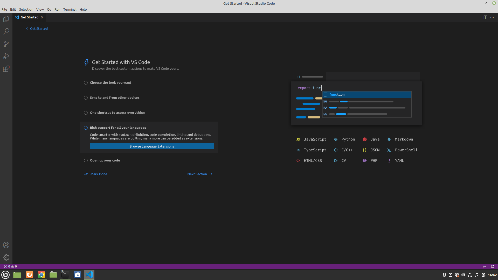

#### 2. Wejdź w Extensions (5 ikonka po lewej od góry).

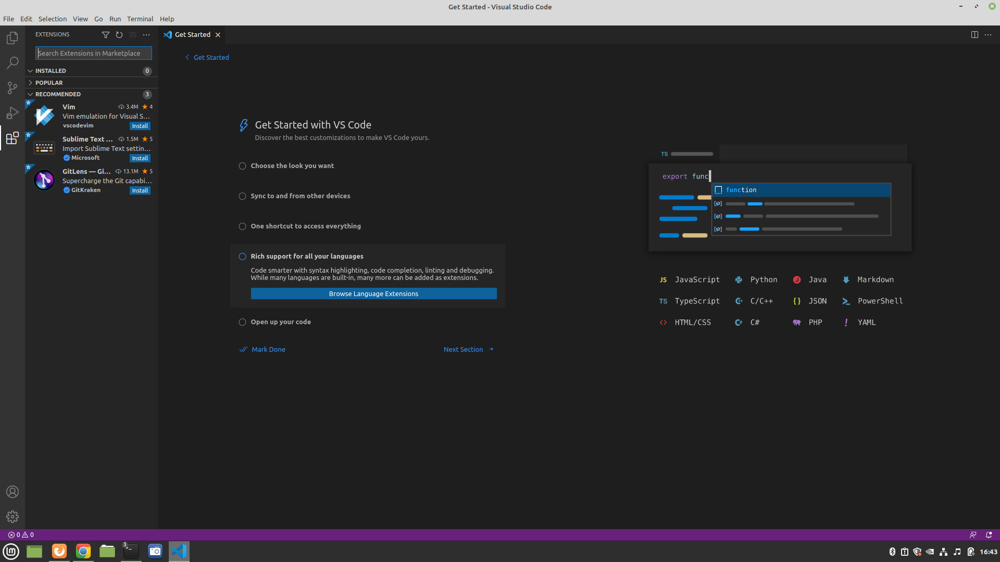

#### 3. W search wpisz: SSH i kliknij w najwyższą pozycję: Remote-SSH i kliknij w niebieski przycisk: Install. 

Gdy się zainstaluje kliknij w zaznaczony na czerwono przycisk z połączeniami.

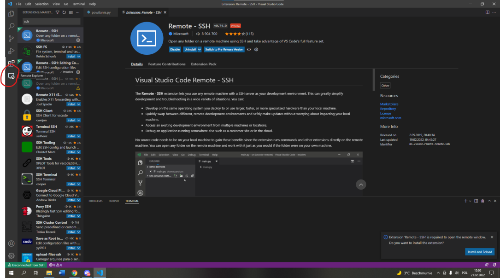

#### 4. Kliknij plusika aby utworzyć nowe połączenie.
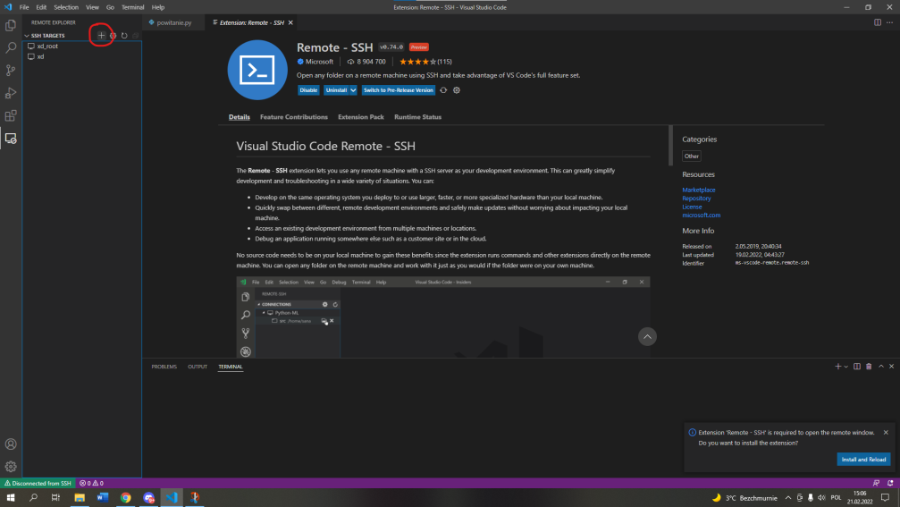

#### 5. Wpisz w połączenie cokolwiek i naciśnij enter.

Tu się normalnie wpisuje coś w stylu:
```
ssh root@1.2.3.4
```
lub
```
ssh -i klucz.pem ubuntu@1.2.3.4
```
Ale Ty wpisz narazie cokolwiek.

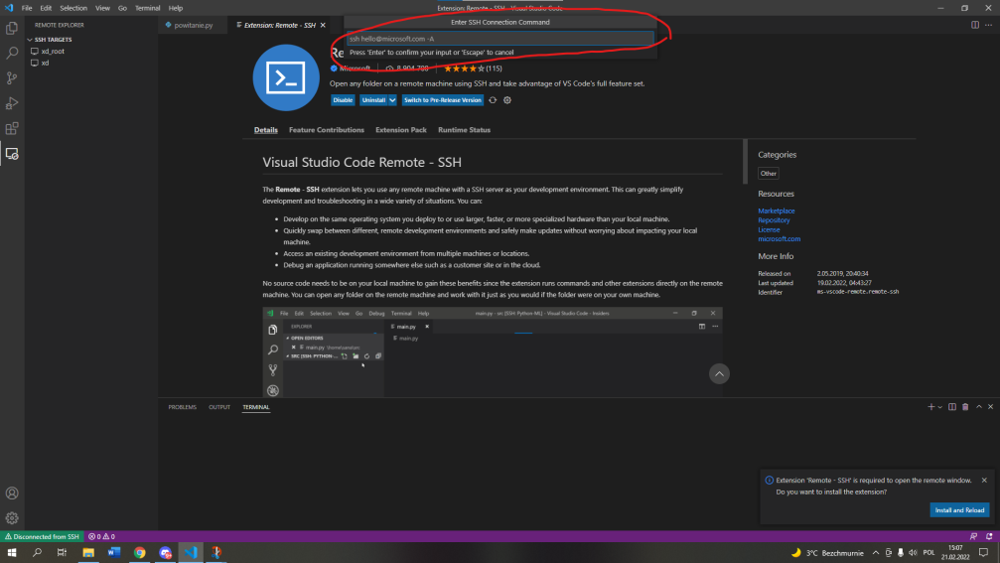

#### 6. Spyta się Ciebie o plik config. 

Wybierz ten który kończy się na .ssh\config. Ten jest zawsze na samej górze listy na niebiesko. Kliknij go.

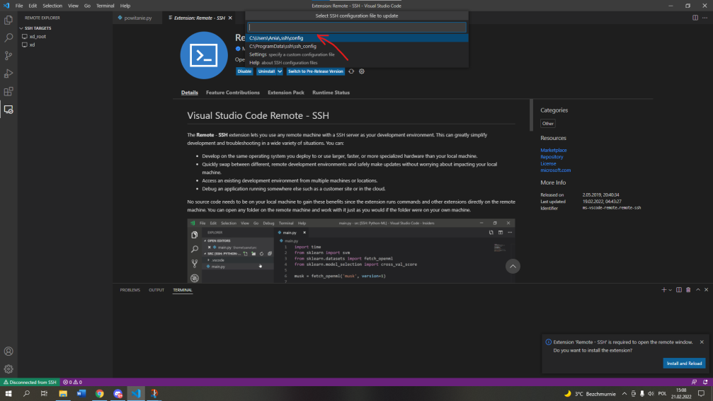

#### 7. Na dole pojawi się okno, kliknij na zaznoczony na czerwono przycisk aby zobaczyć plik config w folderze .ssh

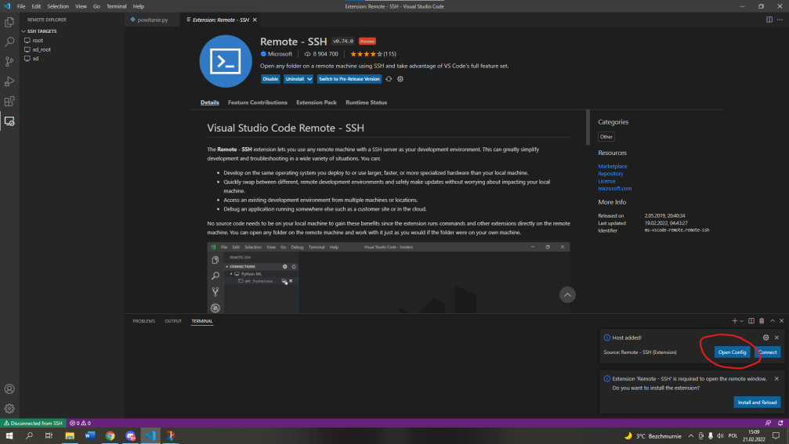

#### 8. Wyświetli Ci się plik config. 

Jeżeli jest pusty, będzie wyglądał jak poniżej. Jeżeli jest pełny i nie wiesz czy są to prawidłowe dane, to skopiuj je, zapisz obok a z tego pliku wykasuj i zaraz uzupełnimy je od nowa.

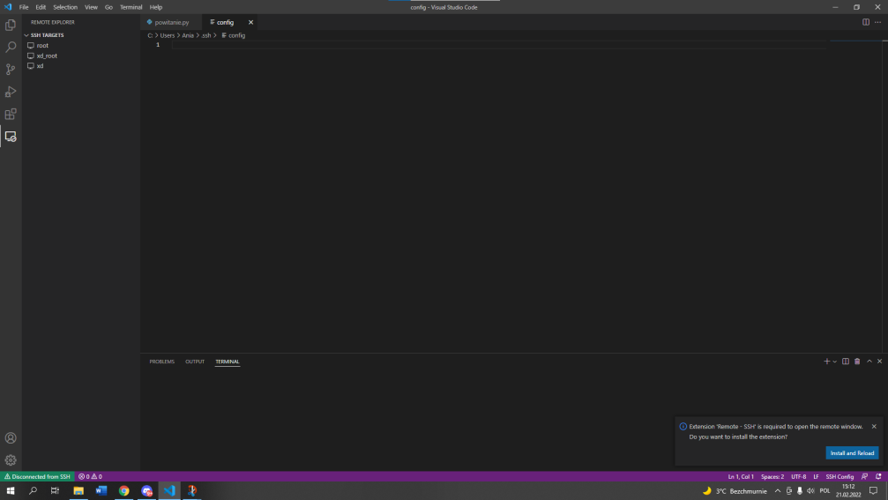

#### 9. Wklej do pliku config poniższe dane:

(Tu będzie też kilka słów więcej o pliku config i folderze .ssh.)


#### config dla Home:

Podmień wartość po prawej stronie HostName w 2 i 7 linii na adres IP do Twojego serwera. Reszty narazie nie ruszaj.

```
Host xd_root
  HostName 1.1.1.1
  User root
	
Host xd
  HostName 1.1.1.1
  User xd
  IdentityFile "~/.ssh/tu_wstaw_nazwe_klucza"
```

#### config dla AWS:

Wklej poniższe linie. Edytuj tam narazie tylko:
a) W linii 4 "IdentityFile "~/.ssh/tu_wstaw_nazwe_klucza.pem" edytuj nazwę klucza .pem
b) W linii 2 i 7 edytuj HostName - podaj prawidłowy adres IP Twojego serwera
c) Reszty narazie nie ruszaj.
d) Upewnij się, że Twój klucz .pem jest w folderze .ssh. Jeżeli nie, niech będzie tam :)

```
Host xd_ubuntu
  HostName 1.1.1.1
  User ubuntu
  IdentityFile "~/.ssh/tu_wstaw_nazwe_klucza.pem"

Host xd
  HostName 1.1.1.1
  User moja_nazwa_uzytkownika
  IdentityFile "~/.ssh/tu_wstaw_nazwe_klucza"
```

Będzie to wyglądało np. w ten sposób jak w screenie z punktu 9. (tutaj opcja z serwerami w Home). 


**I zapisz plik (ctrl+s).**

#### 10. Teraz najtrudniejsze. Połączmy się.

Po lewej stronie, pod "SSH TARGETS" pojawią się 2 pola, po jednym dla każdego "Host" które zdefiniowałeś krok wcześniej. Najedź na jeden z nich. Wtedy ok. 3cm od niego po prawej stronie pojawi się malutka ikonka. Gdzieś w okolicach miejsca zaznaczonego na czerwono w poniższym obrazku. Najedź tam i kliknij.


#### 11. Otworzy się nowe okno z połączeniem z serwerem. 

Spyta się czy chcesz kontynuować. Daj opcję na górze, że tak.

Czasem spyta jeszcze, z jakim systemem się łączysz. Wybierz wtedy Linux (bo taki jest system Twojego serwera) - to zwykle też opcja na samej górze - i klikni w nią także - o ile się pojawiła. Obie wyglądają podobnie jak ta na screenie na dole:


#### 12. Hasło.

Dalej, jeżeli wybrałeś drogę Home, spyta się Ciebie o hasło. Podaj je. Możesz je zawsze zmienić w panelu home. 

Jeżeli wybrałeś drogę AWS i poprawnie podałeś klucz w kroku 9, to tego kroku nie będzie ale odrazu połączysz się z serwerem.

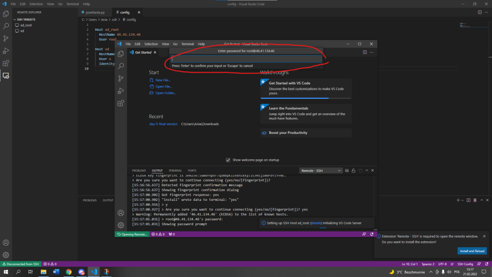

#### 13. Gotowe.

Jeżeli podałeś dobre hasło albo połączyłaś się przez klucz, zobaczysz nadole w lewym rogu okna z nowym połączeniem w zielonym pasku SSH i nazwę Twojego Hosta. Jeżeli jest tam coś poza SSH, to połączenie udało się. Jesteś na serwerze :)

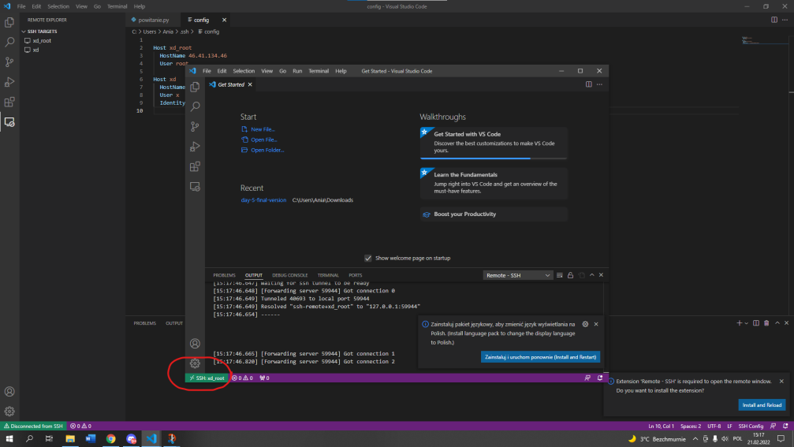

#### 14. Terminal

Kliknij w belkę na samej górze okna, przycisk "Terminal" i wybierz 1 opcję od góry aby się wyświetił.

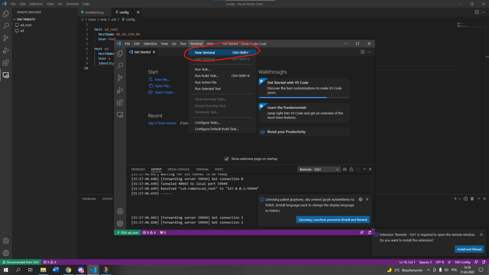

#### 15. Bądź użytkownikiem root (administrator).

Udało się. Oto Twój terminal, wszedłeś na swój serwer. Zobacz jako kto, wpisz:
```
echo $USER
```
Jeżeli Twój serwer jest z Home to pokaże Ci się root, jeżeli z AWS to ubuntu. W krótce stworzymy nowego użytkownika o Twoim imieniu. Ale to za 2 etapy.


Jeżeli nie jesteś root, to bądź :) Jeżeli jesteś na np. ubuntu, ustaw **root**.
```
sudo passwd
su
echo $USER
```

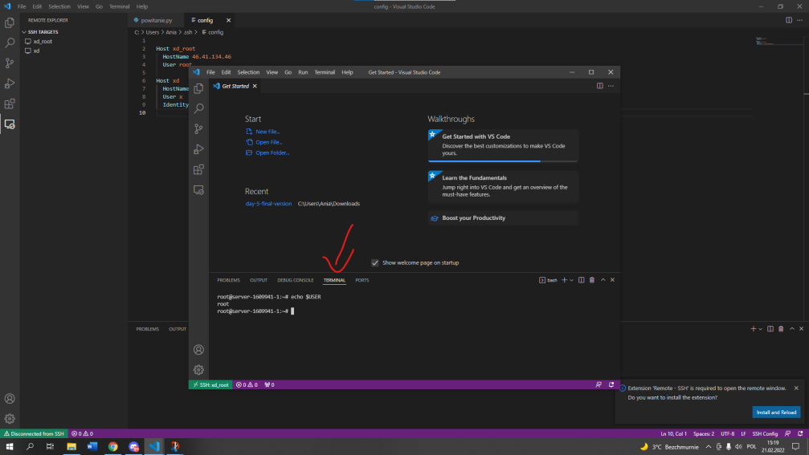

#### 16. Dodatkowy krok: pobaw się w terminalu na serwerze. Wpisz:
Zobacz na jakiej ścieżce jesteś:
```
pwd
````
Przenieś się do katalogu niżej:
```
cd ..
pwd
````
Wylistuj katalogi w folderze w którym jesteś:
```
ls
```
Albo wylistuj ze szczegółami:
```
ls -la
````
Wejdź do jakiegoś z folderów które są w Twoim folderze (Tym w którym jesteś, te które wypisał ls):
```
cd etc
````
Wejdź do folderu którego nie ma w folderze gdzie jesteś korzystając ze ścieżki "bezwzględnej":
```
cd /root
````


#### 16. Update paczek.

Uaktualnij paczki :) wpisz:

```
apt update
```


#### 17. 

Od teraz zawsze połączysz się z serwerem w 3 kliknięciach:
- Włączając VSC
- Klikając w Remote Explorer (5 klocek po lewej)/var/www/flaga/app.py
- Kliknij w znaczek po prawej stronie Twojego serwera na liśćie połączeń
- Wpisz hasło i jesteś na swoim serwerze z poziomu VSCt

I jesteś. 

Połącz się i rozłącz kilka razy.


#### 18. Krok dodatkowy: Spróbuj się połączyć z serwerem terminala/powershell ; )

Na windowsie 10 możesz szybko włączyć powershell, nie ważne w jakim folderze jesteś:
- **linux/mac terminal:** (linux, mac) klikając jednocześnie **ctrl+shift+t**
- **windows powershell:** (windows) otwórz folder w którym chcesz otworzyć terminal i kliknij w adres i napisz tam powershell - otworzy się. Od teraz, nie ważne czy jesteś na powershellu czy w terminalu, będę na tego typu okno mówił terminal, a powershell używał jedynie gdy będę opisywał coś co dotyczy konkretnie powershella.

Jeżeli terminal/powershell otworzy się, wpisz:
```
ssh xd_root
```
Działa? Super! :))) Możesz zacżąć bawić się swoim terminalem/powershellem.
Nie działa? Spoko, pomówimy o tym w przyszłości. Narazie to nie takie ważne, idź dalej :)

[Dodatkowe sposoby i instrukcje łączenia się z serwerem: powershell/terminal/PuTTy dla Win7/8/10/11/LinuxUbuntu/MACOS](http://bityl.pl/6X3gF)


**Serwer zdobyty!**

Teraz połącz się aby zacząć na nim tworzyć. Będziesz pisać tu programy, udostępniać je w sieci i robić wiele innych rzeczy. 


#### Wsparcie:

[Pomoc na discordzie dla problemów związanych z Etapem 4](https://discord.gg/8YQAaBHh3u)


**Przejdź dalej:** [Etap 5 - Domena - Instrukcje](https://github.com/ZPXD/flaga/blob/main/instrukcje/etap_5_domena.md)

