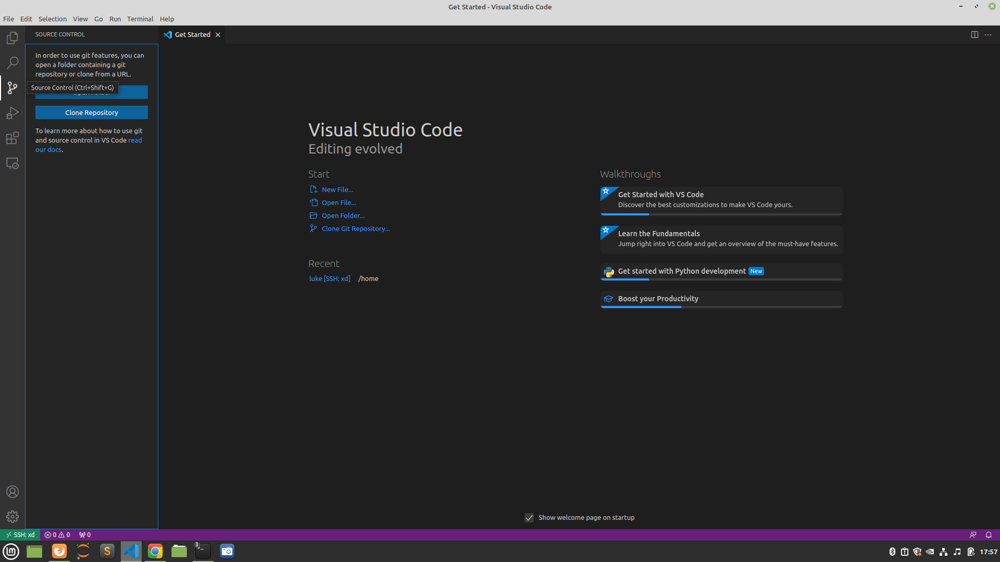
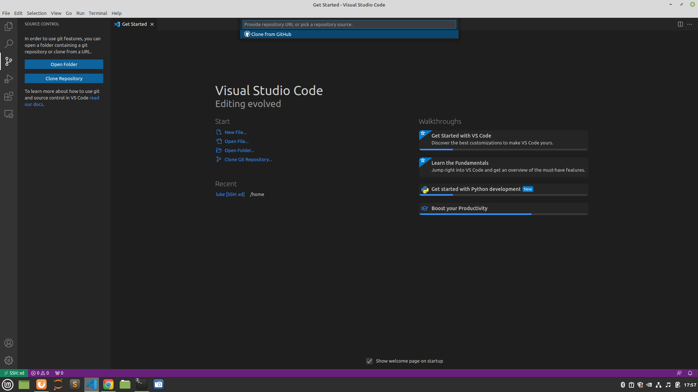

# Szturm na AWS

## Etap 6 - Github

[Zobacz film jak założyć GitHub i sklonować repozytorium](https://www.youtube.com/watch?v=11CAq2Qm7IY)

### Cel:
- Zdobądź konto na Githubie
- Zrób fetch repozytorium LinuxHot16Challenge.
- Zrób na serwerze git clone na flagę i zajecia_programowania_xd


#### Wsparcie:

[Pomoc na discordzie dla problemów związanych z Etapem 6](https://discord.gg/TFTJkAPDD7)


#### Zakładamy konta na githubie.

Github to miejsce gdzie będziemy przez następny rok trzymać pisane przez nas programy, ich kod, opisy, pomocnicze skrypty. 

**Github**, pod spodem którego jest **git** umożliwia Ci trzymanie pod swoim kontem wielu "projektów" - tzw. repozytoriów.
Jest też częstym miejscem które linkujemy gdy chcemy pokazać komuś nasz kod lub współpracować nad jego rozwojem.


#### Plan:
	
#### 1. Github. 

Wejdź, na stronę [Github ZPXD](https://github.com/ZPXD) rozejrzyj się. 
Dodaj ją do zakładek.

#### 2. Github - stwórz konto. Dodaj swój profil do zakładek.
Instrukcja jak założyć konto na Githubie aby rozpocząć gromadzenie swoich programów:
[GitHub - Konto - Instrukcja](http://bityl.pl/ddkCX)

#### 3. Github - fetch.
Zrób 'fetch' na [LinuxHot16Challenge](https://github.com/ZPXD/LinuxHot16Challenge).

#### 4. Git - clone zajecia_programowania_xd

Sklonuj [zajecia_programowania_xd](https://github.com/ZPXD/zajecia_programowania_xd)  korzystając z VSCode. 

1. Link do repo. 

Wejdź na link [zajecia_programowania_xd](https://github.com/ZPXD/zajecia_programowania_xd) i zobacz zielony przycisk. Jak na niego naciśniesz, pokaże Ci się tam ścieżka linku. Skopiuj go. To namiar na git'a tego repozytorium. Przyda się za chwilę.

2. Wróć do VSC. Kliknij w 3 klocek od góry z lewej **(Source Controll)**

3. Kliknij w duży niebieski przycisk na dole **(Clone Repository)**




4. Wklej link do repozytorium które chcesz sklonować




Podanie tam linku do repozytorium to analogia do wpisania w terminalu:
```
git clone https://github.com/ZPXD/zajecia_programowania_xd
```
5. Spyta się Ciebie w jakim folderze zapisać repozytorium - podaj katalog domowy albo root. Narazie to nie istotne.
6. Spyta się Cibie czy otworzyć ten folder - powiedz, że tak


#### 5. Github - clone: flaga.

Otwórz nowe okno z nowym połączeniem z Twoim serwerem. Powtórz to samo dla repozytorium Flagi.

Sklonuj [Flaga](https://github.com/ZPXD/flaga) korzystając z VSCode. 

#### 6. Jesteś gotowy aby przygotować serwer i postawić stronę WWW ze swoją Flagą.

 
**Jeżeli się śpieszysz, pójdź tędy:** [Etap 7.A - Strona www i Flaga - droga ASAP (flaga w 5 minut) - Instrukcje](https://github.com/ZPXD/flaga/blob/main/instrukcje/etap_7_ASAP_strona_www_i_flaga.md)

**Jeżeli nic się nie pali, wybierz tę drogę:** [Etap 7.B - Strona www i Flaga - droga klasyczna - Instrukcje](https://github.com/ZPXD/flaga/blob/main/instrukcje/etap_7_Klasyczna_strona_www_i_flaga.md)
