# Szturm na AWS

## Etap 7 - przygotuj serwer, postaw stronę www i powieś Flagę - wersja Klasyczna

**1. Przygotujesz serwer.** Zupdatujemy i poinstalujemy trochę programów, w tym:
- git'a
- nginx'a
- nano
- program do tworzenia środowisk programistycznych venv

**2. Pobierzesz kod z repozytorium [Flaga](https://github.com/ZPXD/flaga)**
- uzupełnimy plik z danymi o nazwę przygotowanej domeny
- automatycznie "poprozkładamy" pliki konfigurujące nginx i gunicorn we właściwych miejscach

**3. Uruchomisz "usługę" aplikacji strony www** 

tak aby była wystawiona w internecie i zobaczysz swoją stronę www sieci pod linkiem domeny. 

[Obejrzyj film jaks przygotować serwer, postawić stronę i powiesić flagę w wersji ASAP (w 12 minut)](https://www.youtube.com/watch?v=8druPxZBwew)


#### PS: Jeżeli uznasz, że potrzebujesz szybkiej drogi w 5 minut bez wyczerpujących wyjaśnień i mocniejszych doświadczeń, wybierz:

[Etap 7 - droga ASAP - Instrukcje](https://github.com/ZPXD/flaga/blob/main/instrukcje/etap_7_ASAP_strona_www_i_flaga.md)

I postaw cały serwer automatycznie, nie pisząc ani jednej komendy po komendzie ręcznie.


#### Wsparcie:

[Pomoc na discordzie dla problemów związanych z Etapem 7](https://discord.gg/S5bN7TCAYq)


# Droga B: Klasyczna

### 1. Połącz się ze swoim serwerem:

Jeżeli masz z tym problem, wróć do [Etap 4.3 - połączenie z serwerem](https://github.com/ZPXD/flaga/blob/main/instrukcje/etap_4_3_zdobadz_serwer_polaczenie.md) i spokojnie powtórz sobie ten etap.


### 2. Pssst! 
Od teraz, gdyby coś poszło nie tak, zawsze możesz zrestartować serwer i zacząć od nowa: [Resetowanie Serwera](http://bityl.pl/Bmvwu). To potrwa ok 5-10 minut i będziesz mógł zacząć od nowa. Raczej tego nie rób jak nie trzeba - stracisz wszystko co jest na serwerze.

### 3. Root.

Powinieneś być już root. Robiliśmy to w [Etap 4 w kroku 6](https://github.com/ZPXD/flaga/blob/main/instrukcje/etap_4_3_zdobadz_serwer_polaczenie.md). Sprawdź to:
```
echo $USER
```
Jak pokazuje root to idź do kroku 2. Jeżeli nie, utwórz hasło dla root wpisując:
```
sudo passwd
sudo su
```
I sprawdź znów pisząc "echo $USER", aż będzie pokazywać root. Jak masz błąd, wróć do etapu 4.3 lub spytaj na grupie o pomoc.

Jeżeli wszystko zrobiłeś prawidłowo, pojawi Ci się: **root**. Chyba, że jesteś na AWS, to pokaże Ci się **ubuntu**. Root to coś jak administrator. Ma nawet swój folder o ścieżce /root do którego tylko on ma dostęp. Wszystko co ma przypisane uprawnienia **root** możesz robić z jego poziomu. Ty jednak chcesz stworzyć nowego użytkownika. 

Jednak najpierw, minuta dla AWS'owców.

### 4. Użytkownik

Użytkownik to to jako kto jesteś na serwerze. Zwykli użytkownicy mają inne uprawnienia niż root. Nie mogą robić pewnych rzeczy i wchodzić w pewne miejsca.

Napisz w terminalu poniższy kod zamieńiając XXX na nazwę jaką chcesz mieć jako użytkownik Twojego serwera.
Nazwa nie może zawierać spacji i specjalnych znaków.
```
NEW_USER=XXXX
```
Stworzyłeś zmienną NEW_USER. Teraz możesz ją wywoływać zawsze pisząc jej nazwę ze znakiem dolara.
```
echo $NEW_USER
```

#### Tworzymy użytkownika.

Czas stworzyć użytkownika o takiej nazwie jak chcesz.

Będziesz pytany o numer telefonu, pokoju i inne rzeczy - wszystko pomijaj naciskając enter.

Wklej poniższy kod aby stworzyć użytkownika o takiej nazwie jaką wartość przypisałeś do NEW_USER.
```
adduser $NEW_USER --gecos GECOS --disabled-password --force-badname
```
I poniższy kod aby przypisać go do grupy www-data (potrzebnej np. do postawienia strony www) i do grupy sudo (potrzebnej do wykonywania operacji z poziomu użytkownika **root**).


```
adduser $NEW_USER www-data
adduser $NEW_USER sudo
```

Sprawdź czy jesteś w grupie sudo i www-data:
```        
groups $NEW_USER 
```
Wyświetli się: $NEW_USER : $NEW_USER www-data sudo. Jak nie ma sudo i www-data, to pominąłeś krok wyżej.


#### Pozwólmy działać naszemu użytkownikowi bez hasła na serwerze (i tak będziesz łączyć się przez klucz).

Komendą echo "wrzucamy" jedną linię która to robi do pliku konfiguracyjnego sudoers.
```
echo "$NEW_USER ALL=(ALL) NOPASSWD:ALL" >> /etc/sudoers
```

#### Katalog domowy.

Od teraz też masz swój nowy domowy katalog. Narazie nic tam nie ma. Gdy będziesz się logował na swojego użytkownika, tutaj będziesz się pojawiał
```
cd /home/$NEW_USER
pwd
```

### 5. Sudo i uaktualniamy paczki (packages).

Jako użytkownik, pewnych rzeczy robić nie możesz. Np. wchodzić na niektóre foldery, modyfikować pewnych plików czy ich w pewnych miejscach tworzyć. Ani nie możesz instalować nowych paczek. 

Upewnij się, że jesteś 
```
su $NEW_USER
```

#### Pytanie [Y/n]

PS: w trakcie różnych instalacji gdy proces się zatrzymuje z zapytaniem "Do you want to continue? [Y/n]" na końcu, napisz "Y" aby przejść dalej.

#### Zaktualizuj paczki:
```
apt update 
```
Nie działa. A spróbuj z sudo:
```
sudo apt update 
```
Teraz upewniliśmy się, że paczki na naszym serwerze są zaktualizowane. Czasem wchodząc na nowy serwer mamy doczynienia z niezłym skansenem i zawsze warto to zrobić przed całą resztą.

Dzięki sudo możesz robić takie rzeczy jak instalacje. Zwłąszcza takie które mają wpływ na bardziej systemowe rzeczy, jak np. powyższe aktualizowanie paczek, 

#### Upewnij się gdzie jesteś:

Napisz pwd a poznasz ścieżkę katalogu w którym jesteś.
```
pwd
```
Gdziekolwiek jesteś, przenieś się do swojego katalogu domowego. Zrobisz to używając komendy cd.

#### Teleportacja.

Przeniesiesz do dowolnego katalogu pisząc cd + ścieżka. Lećmy do Twojego katalogu domowego.
```
cd /home/$USER
```

### 6. Tworzenie klucza ".rsa"

Stwórz klucz RSA :)

Stwórz katalog .ssh pisząc mkdir + ścieżka folderu.
```
mkdir /home/$USER/.ssh
```

Nadaj mu wymagane uprawnienia i wejdź do środka:
```
chmod 700 /home/$USER/.ssh
cd  /home/$USER/.ssh
```
Nazwij swoje klucze rsa. Bez spacji, znaków specjalnych. Najlepiej tak abyś kojarzył to z Twoim użytkownikiem i serwerem, projektem, np. klucz=xd_moj_uzytkownik:
```
klucz=NAZWA_KLUCZA
```
Stwórz parę kluczy RSA: prywatny i publiczny. Zapisz publiczny do authorized_keys i ustaw mu uprawnienia na 600 używając chmod. Wklej poniższe (to gęstsze komendy, ale nie martw się tym aż tak, opowiemy wszystko na zajęciach):
```
ssh-keygen -f /home/$USER/.ssh/$klucz -C $USER -N ''
cat /home/$USER/.ssh/$klucz.pub > /home/$USER/.ssh/authorized_keys
chmod 600 /home/$USER/.ssh/authorized_keys
chmod 600 /home/$USER/.ssh/$klucz
```

Sprawdź, czy klucz został stworzony. 
```
ls
```
Pojawią się 2 klucze. W przeciwnym razie powtórz te kroki albo daj znać, 
że potrzebujesz pomocy.

### 7. Pobieranie z serwera KLUCZA rsa .pub 

I gotowe :) teraz, aby logować się bez hasła krótką komendą, 

pobierz jeszcze klucz RSA, umieść go wypełniając poniższe:

#### 1. Otwórz VSCode i wejdź na swój serwer. 

Jeżeli masz z tym problem, wróć do [Etap 4.3 - połączenie z serwerem](https://github.com/ZPXD/flaga/blob/main/instrukcje/etap_4_3_zdobadz_serwer_polaczenie.md) i spokojnie powtórz sobie ten etap.

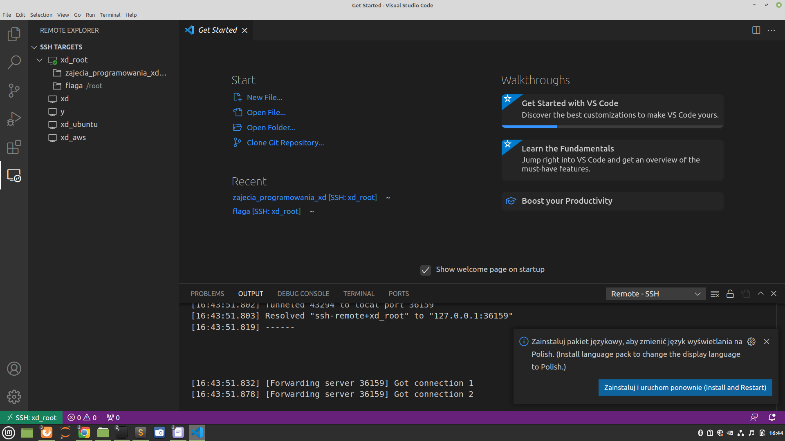


#### 2. Kliknij w "otwórz folder" i pokaże Ci się na górze belka z miejscem na adres folderu. Kliknij tam i skasuj go.

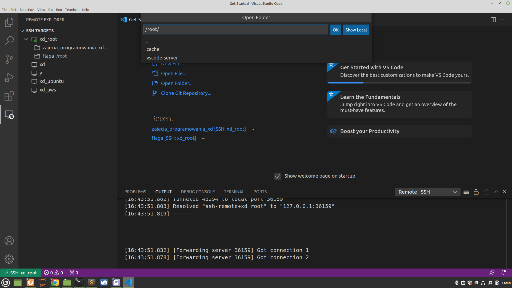

##### 3. Wpisz tam /home/X/.ssh <--- zamiast X - podaj nazwę swojego użytkownika, tę samą którą podawałeś na początku etapu 7.

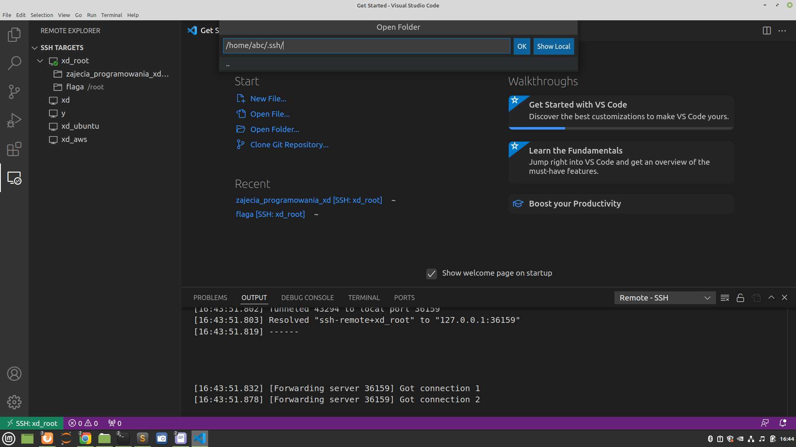


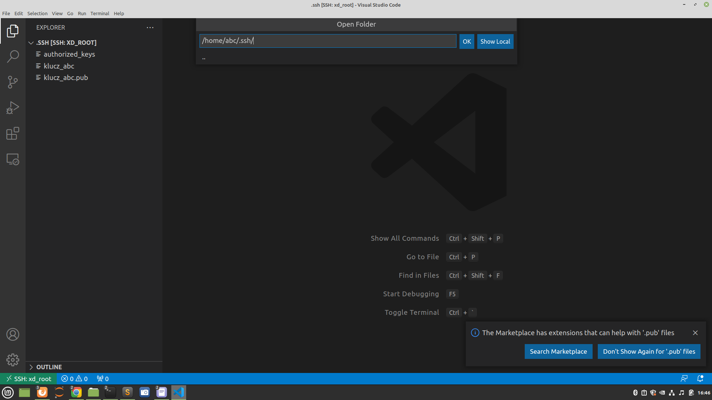

#### 4. Kliknij ok. Pokaże Ci się folder .ssh z kluczami.

#### 5. Wybierz nowoutworzony klucz bez rozszeżenia .pub i pobierz go do siebie na komputer do swojego folderu .ssh.

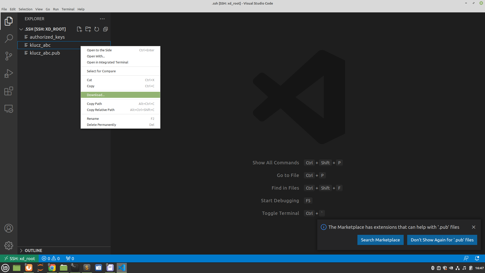

#### 6. Opcjonalnie: czasem, jeżeli nie widzisz swojego folderu .ssh jak ja (a jest on zawsze w folderze domowym Twojego użytkownika na komputerze) - być może musisz kliknąć prawym przyciskiem myszy i odblokować tę opcję.


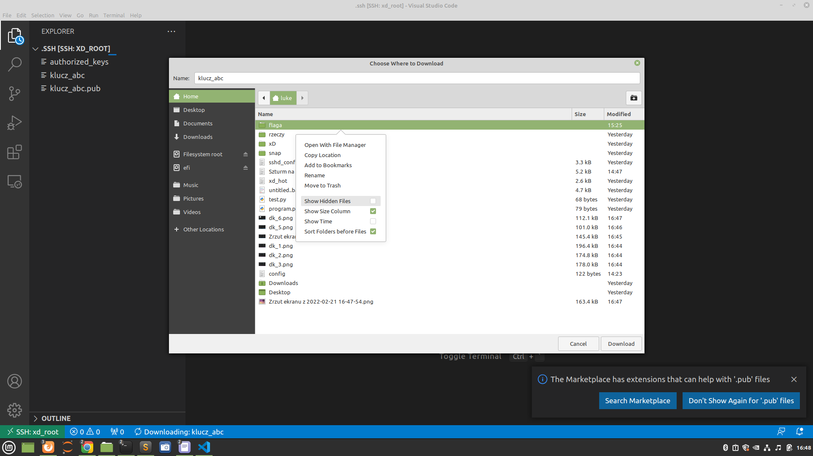

#### 7. Wejdź do folderu .ssh i tutaj zapisz plik z kluczem.

Ewentualnie zapisz go gdzie chcesz i skopiuj go do folderu .ssh potem tak jak uznasz.

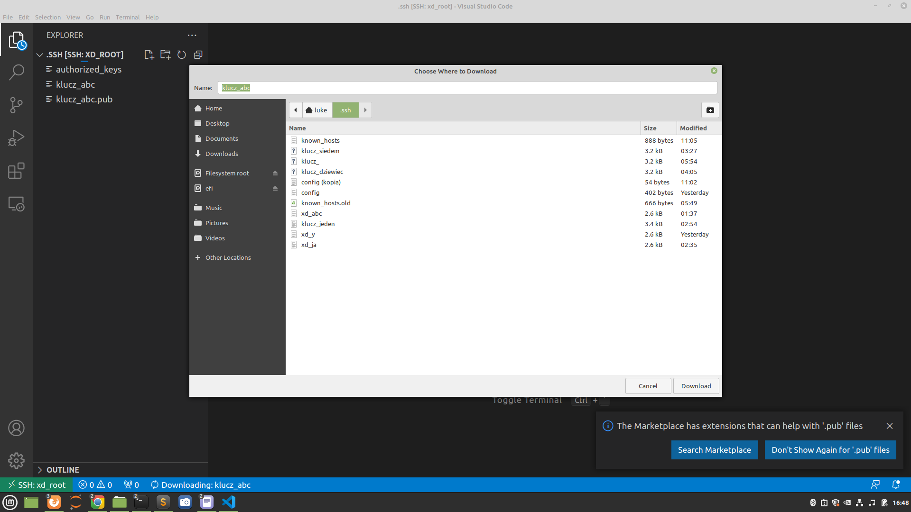

#### 8. Włącz znów VSC. Kliknij w "SSH-Targets" w zembatkę (drugi przycisk po prawej od "SSH-TARGETS")

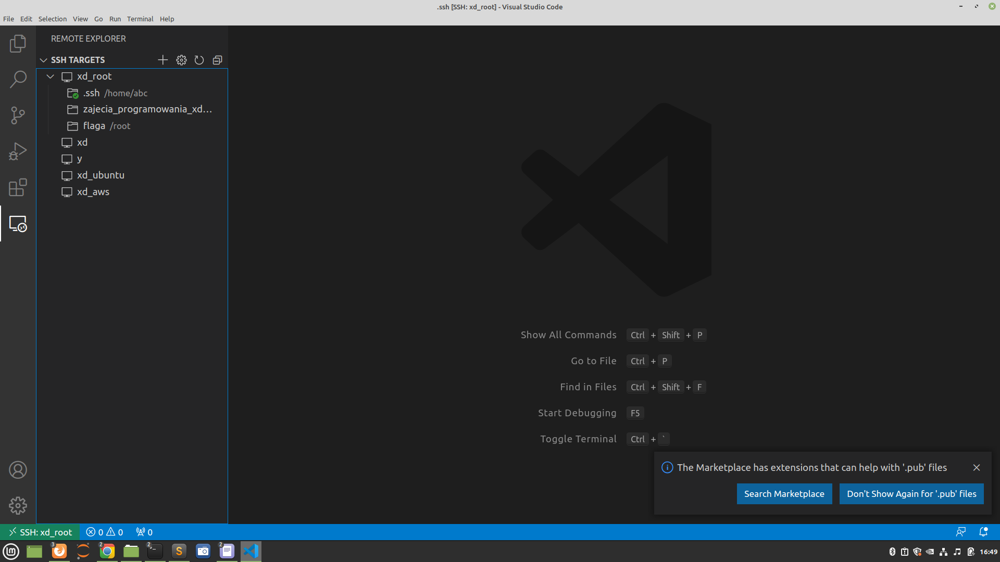


#### 9. Spyta Cię który plik edytować. Wybierz config z folderu .ssh (ten plik najwyżej na liście). I otwórz go.

Jeżeli jesteś w Home i wkleiłeś to o co prosiłem wcześniej, to zobaczysz coś w tym stylu (tylko inne adresy IP).

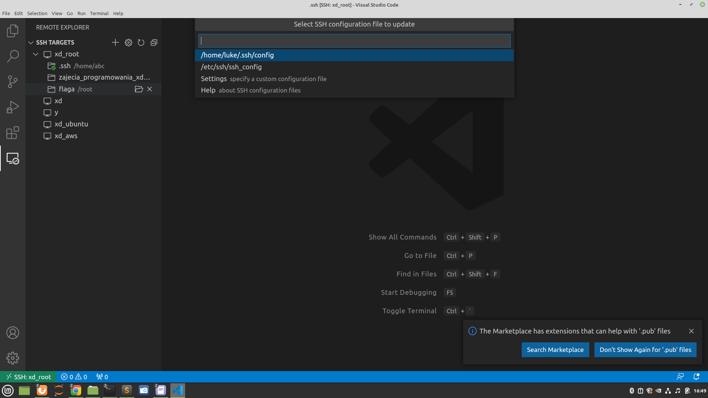


#### 10. Kliknij aby przejść dalej w terminalu instalacji ASAP.

Będzie tam fragment pliku Host do wklejenia. Będzie wyglądał podobnie do:

```
Host xd
  HostName 1.1.1.1
  User moja_nazwa_uzytkownika
  IdentityFile "~/.ssh/tu_wstaw_nazwe_klucza"
```

#### 11. Edytuj plik wstawiając swoje adresy IP, popraw nazwę klucza i zmień nazwę użytkownika w 2gim Hoście. Zapisz plik.

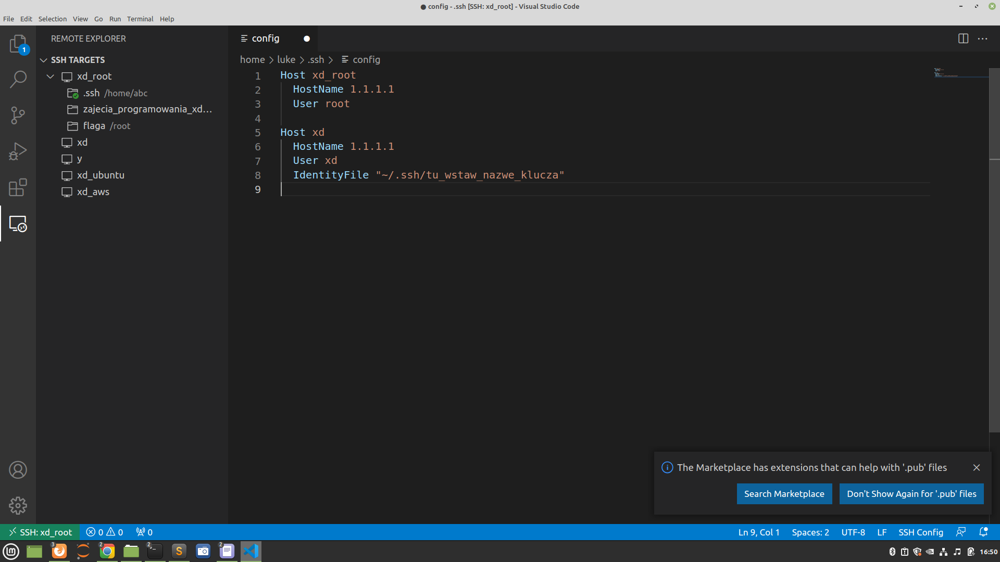

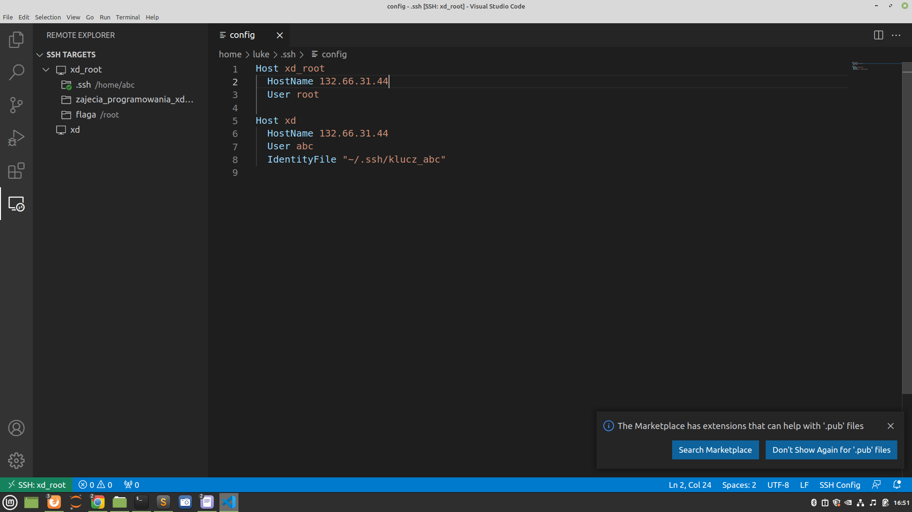


Sprawdź teraz połączenie przez SSH-TARGETS. Kliknij plusik i napisz "ssh xd" Jeżeli się połączysz to znaczy, że wszystko działa i przejdź do kroku 12. W przeciwnym razie, możliwe, że:
a) Twój plik known_hosts w folderze .ssh jest zawalony - skasuj go.
b) Twój klucz ma zbyt słabe uprawnienia z uwagi na to, że pobieraliśmy go przez VSCode. Wtedy użyj scp.

Wejdź do swojego folderu .ssh na komputerze u siebie i otwórz terminal/powershell (w  windowsie: kliknij w zakładkę z adresem i wpisz powershell, nacisnij enter).

W terminalu/powershellu wpisz komendę:

Dla serwerów na home:
```
scp root@$TU_WSTAW_IP_SERWERA:/home/TU_WSTAW_NAZWE_UZYTKOWNIKA/.ssh/$klucz $klucz
```

Dla serwerów na AWS: 

Najpierw skopiuj klucz do katalogu domowego ubuntu:
```
cp /home/$USER/.ssh/$klucz /home/ubuntu/$klucz
chown ubuntu:ubuntu /home/ubuntu/$klucz
```

A następnie pobierz go (zamień nazwę klucza 'klucz_xd.pem' na inna, jeżeli inaczej nazwałeś swój klucz do serwera na AWS):
```
scp -i klucz_xd.pem ubuntu@$TU_WSTAW_IP_SERWERA:/home/ubuntu/.ssh/$klucz $klucz
```

I spróbuj połączyć się przez VSCode znowu (cofnij się do instrukcji wyżej, jeżeli nie pamiętasz jak to zrobić). Jeżeli masz problem, napisz na discordzie.


## Kontynuuj dalej już Twój użytkownik.


Postaw stronę www tak, abyśmy widzieli ją w sieci.

- miejsce na stronę: folder /var/www
- git
- Instalacja paczek systemowych wymaganych do postawienia strony.
- Wewnątrz środowiska (env).
- Instalacja wymaganych bibliotek.
- Stworzenie plików z informacjami dla serwera aby wystawił stronę (nginx i gunicorn).
- Restart nginxa i serwisów.
- Moja strona działa!


### 1. Miejsce na stronę: Folder /var/www 


Poza tym na AWS trzeba stworzyć folder, gdzie będziemy trzymać Twoją stronę z flagą: mkdir i nazwa folderu: /var/www. Dodaj 2>1 aby nie wyświetlało błędu, jeżeli folder już istnieje. I wejdź do /var.
```
mkdir /var/www
cd /var
```
Jeżeli ten katalog już istnieje (będzie błąd) - jest ok - idź dalej.

W środku znajduje się katalog www. Tam będziemy trzymać strony. Nadaj mu uprawnienia które pozwolą potem na dostęp do plików danych. I wejdź do środka.
```
sudo chown -R www-data:www-data /var/www
sudo chmod -R 775 /var/www
cd /var/www
```

### 2. Git.

Instalujemy git'a. To narzędzie do pobierania repozytoriów czyli powiedźmy projektów, aplikacji. My pobieramy repozytorium flagi, które zawiera wszystko czego potrzeba abyś postawił stronę www i zawiesił flagę. Zainstaluj go używając apt, co zrobisz jako użytkownik tylko, jak pamiętasz, używając sudo.
```
sudo apt install git
```
I pobieramy (to) repozytorium i rozkładamy manatki.
```
git clone https://github.com/ZPXD/flaga.git
```

I wejdź do flagi.
```
cd flaga
```
Wszystkie polecenia od teraz do końca skryptu wykonywane są wykonywane w folderze /var/www/flaga .

PS: Zawsze możesz sprawdzić w którym folderze jesteś, pisząc:
```
pwd
```

### 3. Domena.

Ustaw nazwę aplikacji i MODYFIKUJ nazwę domeny.:
```
domena=TUTAJ_WPISZ.pl
echo 'Moja domena to:' $domena
```

Domena się nie zgadza? Popraw powyższe. Zgadza? Chodźmy dalej.

Chcesz dowiedzieć się trochę co się dzieje pod maską, samemu to poczuć i przeklikać? Świetny wybór, czegoś się nauczysz albo chociaż nabierzesz obycia i doświadczenia. Do dzieła.

#### Instalacja paczek systemowych wymaganych do postawienia strony.

Uruchom skrypt pythona który zawiera serię komend dla linuxa, które zrealizuje automatycznie. Jeżeli jesteś ciekaw co to za komendy możesz podejrzeć plik pisząc cat + nazwa_pliku (**cat /var/www/flaga/pomocnicze_skrypty/xD.py** ).
PS: chodzi o xD.py z dużej litery xD.py a nie xd.py z małej litery.
```
sudo python3 /var/www/flaga/pomocnicze_skrypty/xD.py
```
PS: Tak jak się domyślasz, terminal nie czyta niczego po znaku "#" zobacz samemu, wpisz:
```
ls # sdfgsdfgsdgsgjpodgksg
```

### 4. Wewnątrz środowiska (env).

Wszystkie polecenia wykonywane w tym kroku są wykonywane w folderze /var/www/flaga .

Upewnij się w jakim folderze jesteś, napisz:
```
pwd
```
Jeżeli to nie /var/www/flaga to napisz w terminalu:
```
cd /var/www/flaga
```

Stwórz środowisko:
```
python3 -m venv flagaenv      # Stwórz środowisko flagenv używając venv.
source flagaenv/bin/activate  # Aktywuj środowisko flagaenv
export FLASK_APP=app.py       # I zapisz zmienną FLASK_APP równą app.py (nazwie programu strony www) 
```

#### Instalacja wymaganych bibliotek.
Użyjemy do tego **pip3** - to narzędzie którym pobieramy w pythonie potrzebne biblioteki. We fladze używamy dodatkowo pliku **requirements.txt**, który jest niczym innym jak listą nazw i wersji bibliotek które będą.
```
pip3 install -r requirements.txt
```

#### 6. Dodanie domeny.

Zefiniuj zmienną w bashu np:
```
domena=nazwa_domeny.pl
echo $domena
```

#### 7. Stworzenie plików z informacjami dla serwera aby wystawił stronę (nginx i gunicorn).
Uruchom skrypt przygotowujący hosting na serwerze (1 raz).
```
sudo python3 pomocnicze_skrypty/xd.py $domena
```

#### Restart nginxa i serwisów. To zadziało się automatycznie. Nie musisz tego robić.

To przyda Ci się za każdym razem, gdy po modyfikacji plików html lub programu app.py będziesz chciał zobaczyć zmiany na stronie.
```
sudo systemctl daemon-reload
sudo systemctl restart nginx
sudo systemctl restart flaga.service
```
lub, jeżeli chcesz, napisałem skrypt który to robi za Ciebie.
```
sudo python3 pomocnicze_skrypty/reload.py
```
#### Gdyby coś poszło nie tak w kroku 6 i 7
Użyj tej komendy a cofniesz się do początku kroku 6.

Jeżeli modyfikowałeś zmienną domena, wpisz:
```
python3 pomocnicze_skrypty/usun_pliki_serwerowe.py $domena
```
Jeżeli modyfikowałeś plik settings.ini, albo to i to, to użyj:
```
python3 pomocnicze_skrypty/usun_pliki_serwerowe.py
```

### 8. Zobacz czy strona działa!

Wejdź na adres Twoje strony w wyszukiwarkę. Zobacz czy strona działa. Nie? Pogłówkuj trochę i/lub napisz na pomoc. 

Działa? Wyślij komuś, pochwal się komuś.

## 9: Flaga.

- Edytuj plik tekstowy którego treść widać na Twojej stronie.
- Zobaczy czy na stronie jest nowa treść!
- Stwórz nową zakładkę wymaganą do przejścia szturmu!
- Zobacz czy zakładka działa :)


#### Edytuj plik tekstowy którego treść widać na Twojej stronie.

Urządź się tu :) Będąc dalej na serwerze, w folderze /var/www/flaga edytuj zawartość pliku xd.txt. Dodaj tam coś od siebie. Modyfikuj plik:
```
/var/www/flaga/dane/xd.txt
```

#### Zobaczy czy na stronie jest nowa treść!


Zobacz na stronie www czy działa :)


#### Stwórz nową zakładkę wymaganą do przejścia szturmu!

Ostatnie co zostało, to edycja zakładki /xd flagi. Twoja flaga aby przejść dalej musi spełniać 3 kryteria. 
- być widoczna w sieci, czyli działać - to mamy
- w zakładce xd jest na niej "xD" - to też już mamy
- w zakladce xd jest na niej coś napisane poza "xDDD" - to mamy do zrobienia.

Wejdź w przeglądarce na adres swojej strony www i dopisz **/xd** - to Twoja zakładka /xd.

Bedąc dalej w folderze /var/www/flaga edytuj plik templates/xd.html. Zobacz, jest tam w 12 linii "xDDD". Zostaw xD (z dowolną ilością "D") i: dodaj coś od siebie. Dzięki temu będzie można sprawdzić czy ukończyłeś ten etap. Otwórz:
```
/var/www/flaga/templates/xd.html
```
To plik html. Dodaj coś w 12 linii pomiędzy znakami ">" a "</h1>".
```
<h1 style="text-align:center">xDDD TUTAJ OD SIEBIE DOPISZ :) </h1>
```
Przeładuj:
```
sudo python3 pomocnicze_skrypty/reload.py
```

#### Zobacz czy zakładka działa :)

Zobacz na stronie www czy działa :) - dodaj do swojego adresu "/xd" czyli jak masz domenę "kubus-puchatek.pl" to wpisz "kubus-puchatek.pl/xd".


#### Gotowe?
Możesz opuścić Terminal pisząć:

Najpierw aby się wylogować:
```
exit
```
Potem aby opuścić terminal:
```
exit
```
A strona nadal będzie stała w internecie.


**Przejdź dalej:** [Etap 8 - Materiały i Jupyter - Instrukcje](https://github.com/ZPXD/flaga/blob/main/instrukcje/etap_8_materialy_i_jupyter.md)
